# Morse Practice Page (MPP) — Developer Guide

This document describes how the **LICW Morse Practice Page** is structured, built, and run in the browser. It is written for developers (and advanced tinkerers) working in this repository.

**Related:** [README](../README.md) (project overview), [tests/README](../tests/README.md) (testing), [AGENTS.md](../AGENTS.md) (fork/agent notes).

---

## Table of contents

1. [Architecture overview](#1-architecture-overview)
2. [Runtime: page load to first Play](#2-runtime-page-load-to-first-play)
3. [HTML layout (`src/template.html`)](#3-html-layout-srctemplatehtml)
4. [Knockout.js (MVVM)](#4-knockoutjs-mvvm)
5. [Bootstrap’s role](#5-bootstraps-role)
6. [TypeScript module map](#6-typescript-module-map)
7. [Lesson and preset data](#7-lesson-and-preset-data)
8. [Build pipeline](#8-build-pipeline)
9. [Playback pipeline](#9-playback-pipeline)
10. [Settings and persistence](#10-settings-and-persistence)
11. [Where to change what](#11-where-to-change-what)
12. [Local development](#12-local-development)

---

## 1. Architecture overview

The app is a **single-page application**: one HTML shell, one root Knockout view model, Webpack bundles JS/CSS into `dist/`, and the browser plays Morse via Web Audio (optional TTS voice).

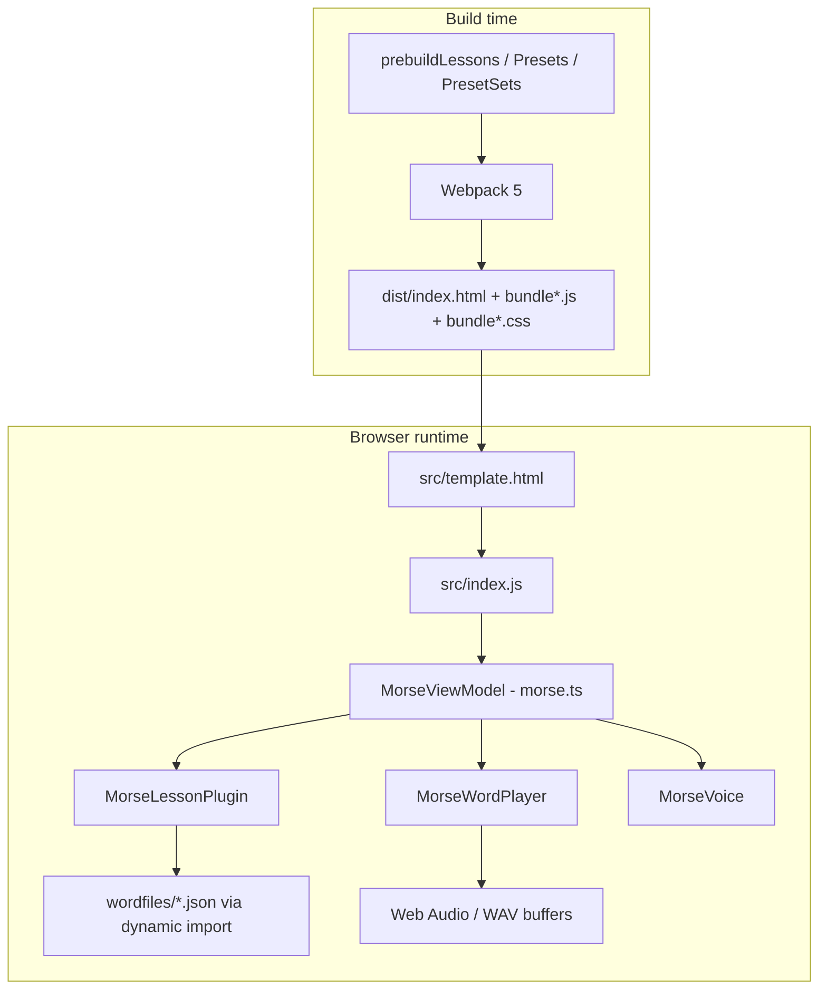

| Layer | Technology | Role |
|--------|------------|------|
| UI markup | `src/template.html` + Bootstrap 5 | Layout, accordions, forms, grid |
| UI state | Knockout 3.5 | `data-bind` ↔ observables on `MorseViewModel` |
| App logic | TypeScript in `src/morse/` | Lessons, timing, playback, cookies, voice |
| Bundler | Webpack 5 | Entry `src/index.js` → hashed bundles in `dist/` |
| Content | JSON under `src/wordfiles/`, `src/presets/` | Lesson text and preset settings |

**Design intent (from project README):** Knockout + Bootstrap were chosen to stay approachable for ham tinkerers. TypeScript was added later for safer refactors as features grew.

---

## 2. Runtime: page load to first Play

### 2.1 What the user receives after `npm run build`

| Output | Source |
|--------|--------|
| `dist/index.html` | `src/template.html` + Webpack-injected script/link tags |
| `dist/bundle[contenthash].js` | Webpack entry graph |
| `dist/bundle.[contenthash].css` | Bootstrap + `style.css` + `dark-mode.css` |

`HtmlWebpackPlugin` (`webpack.config.js`) uses `src/template.html` as the template. You will **not** see manual `<script src="bundle...">` in the source template—Webpack injects them at build time.

### 2.2 Boot sequence

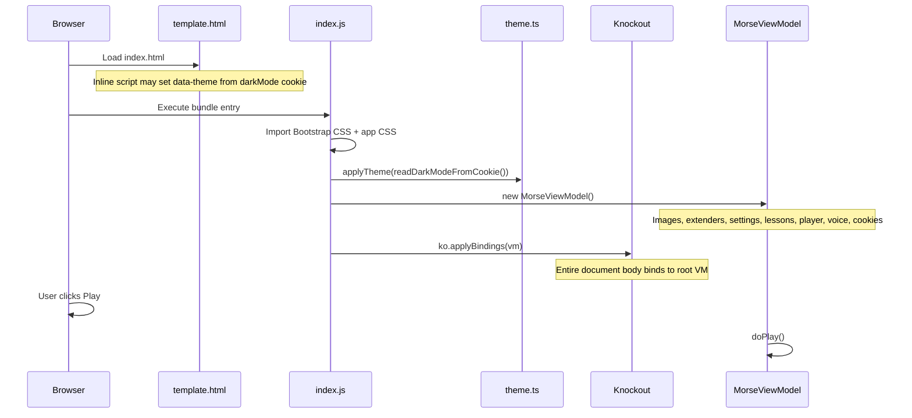

**Entry file:** `src/index.js`

```javascript
import ko from 'knockout'
import 'bootstrap/dist/css/bootstrap.min.css'
import { Tooltip, Toast, Popover } from 'bootstrap'  // used by accordions
import './css/style.css'
import './css/dark-mode.css'
import { applyTheme, readDarkModeFromCookie } from './morse/theme/theme.ts'
import { MorseViewModel } from './morse/morse.ts'

applyTheme(readDarkModeFromCookie())
ko.applyBindings(new MorseViewModel())
```

### 2.3 `MorseViewModel` constructor wiring

Construction order in `src/morse/morse.ts` (simplified):

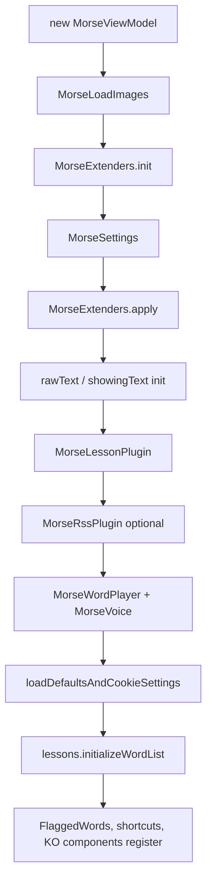

**Registered Knockout components** (in constructor):

| Component name | Module | Purpose |
|----------------|--------|---------|
| `simpleimage` | `components/morseImage/simpleImage.ts` | Accessible icon img from `morseLoadImages` |
| `noiseaccordion` | `components/noiseAccordion/` | Background noise UI (URL flag) |
| `rssaccordion` | `components/rssAccordion/` | RSS feed UI (URL flag) |
| `flaggedwordsaccordion` | `components/flaggedWordsAccordion/` | Flagged practice words |

Component templates are small `.html` files loaded through Webpack `html-loader` and passed as `template:` strings to `ko.components.register`.

---

## 3. HTML layout (`src/template.html`)

The page is a Bootstrap **`container-fluid`** with stacked sections. Bindings assume **one root view model** for the whole document (no nested `ko.applyBindings` root).

### 3.1 Page regions (top → bottom)

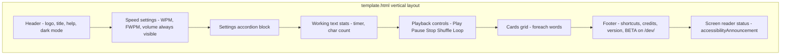

| Section | Approx. lines | Purpose |
|---------|---------------|---------|
| Header | ~48–67 | Logo click handler, help anchor, dark mode toggle |
| Speed settings | ~70–112 | Character WPM, effective FWPM, volume |
| Settings accordion | ~115–988 | All collapsible configuration |
| Working text stats | ~992–1013 | Elapsed play time, chars played / total |
| Playback controls | ~1016–1085 | Transport + reveal + shuffle + loop |
| Cards | ~1090–1103 | One button per word/card |
| Footer | ~1105–1155 | Keyboard shortcuts table, credits, v2.0 |
| SR status | ~1158–1160 | Live region for announcements |

### 3.2 Settings accordions (order in DOM)

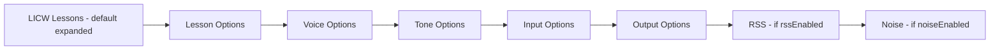

| Accordion | Key bindings / behavior |
|-----------|-------------------------|
| **LICW Lessons** | `lessons.userTarget`, `selectedClass`, `letterGroup`, `selectedDisplay`, `selectedSettingsPreset`; Bootstrap dropdowns + `foreach` |
| **Lesson Options** | Fieldsets: **Overrides**, **Playback**, **Timing**, **Trail** (last) — custom group, overrides, randomize, keep lines, shuffle intra-group, speed intervals, repeats, trail |
| **Voice Options** | `morseVoice.*` — enabled, spell, speak-first, delays, speaker, pitch, rate |
| **Tone Options** | `settings.frequency` DIT/DAH, Zero Beat test tone |
| **Input Options** | `showRaw`, `showingText` textarea, clear, file insert; **Flagged cards** via `flaggedwordsaccordion` component |
| **Output Options** | `preSpace`, `xtraWordSpaceDits`, `cardSpace`, `cardFontPx`, `cardsVisible`, `doDownload` WAV |
| **RSS / Noise** | `<!-- ko if: ... -->` + `component: { name: '...' }` |

**Fresh Play** (not resume) collapses open accordion panels via `collapseSettingsAccordions()` in `morse.ts` (DOM class manipulation, not Knockout).

### 3.3 Common `data-bind` patterns

| Binding | Typical use |
|---------|-------------|
| `textInput:` | Two-way inputs (WPM, textarea) |
| `text:` / `visible:` / `hidden:` | Display and conditional sections |
| `click:` | Buttons (`doPlay`, `shuffleWords`, theme toggle) |
| `checked:` | Toggles (voice, shuffle, cards visible) |
| `foreach:` | Cards, shortcut keys, lesson dropdown items |
| `component:` | Sub-accordions passing `{ root: $root }` |
| `if:` | RSS, noise, BETA warning (`isDev()`) |
| `$root` / `$parent` | Reach `MorseViewModel` from nested `foreach` contexts |

**Note:** README still mentions `src/index.html` historically; the live template is **`src/template.html`**.

---

## 4. Knockout.js (MVVM)

### 4.1 Model–View–ViewModel

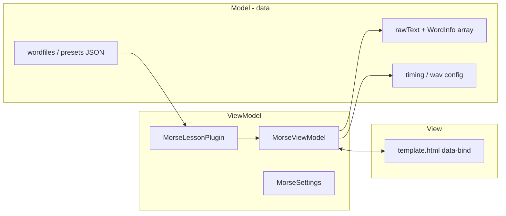

- **View:** `src/template.html`
- **ViewModel:** `MorseViewModel` + attached plugins (`lessons`, `morseVoice`, `settings`, …)
- **Model:** JSON lesson files, preset configs, cookies, and in-memory text/timing state

### 4.2 Key observables and computeds

| Property | Type | Role |
|----------|------|------|
| `showingText` | observable | Text shown in Input Options textarea when “View text” is on |
| `rawText` | observable | Source text for playback and cards |
| `showRaw` | observable | Toggle view/hide working text |
| `words` | **computed** | `MorseStringUtils.getWords(rawText, newlineChunking)` |
| `currentIndex` | observable | Active card index during play |
| `playerPlaying` | observable | Transport state |
| `hideList` | observable | Mask card text as `X` repeats |
| `isShuffled` | observable | Shuffle mode + undo via `preShuffled` / `lastShuffled` |

### 4.3 Text sync: `showingText` vs `rawText`

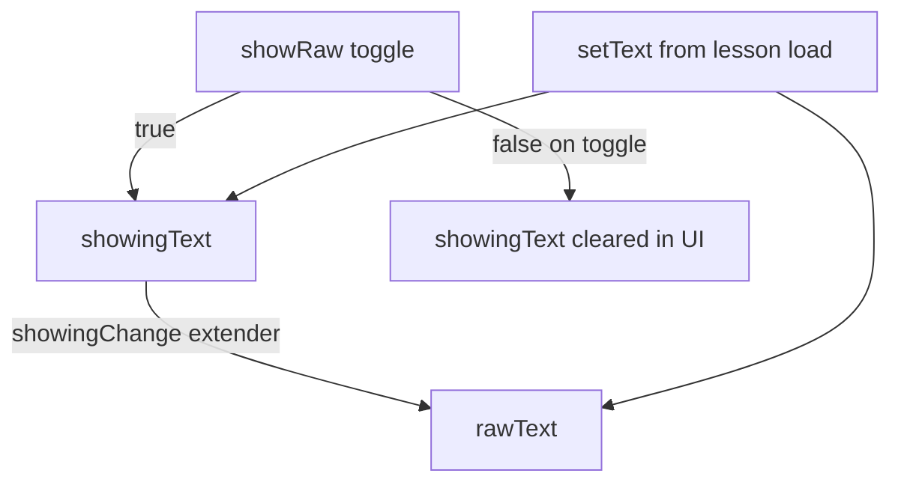

`setText(s)` in `morse.ts` writes to `showingText` or `rawText` depending on `showRaw()`, and clears the voice buffer.

### 4.4 Custom extenders (`koextenders/morseExtenders.ts`)

| Extender | Behavior |
|----------|----------|
| `saveCookie` | Persist observable to `js-cookie` (365 days) when `allowSaveCookies()` |
| `showingChange` | `showingText` edits update `rawText` while view is open |
| `showRawChange` | Toggling view copies `rawText` into textarea or clears display |
| `setVolume` / `setNoiseVolume` / `setNoiseType` | Push to `MorseWordPlayer` |
| `undoIsShuffled` | Manual `rawText` edit clears shuffle if text ≠ `lastShuffled` |
| `sWakeLock` | Screen wake lock while `playerPlaying` |

Lesson plugin adds `classOrLetterGroupChange` to refresh preset lists when class/content changes.

---

## 5. Bootstrap’s role

Bootstrap provides **layout and widgets only**. Application state lives in Knockout.

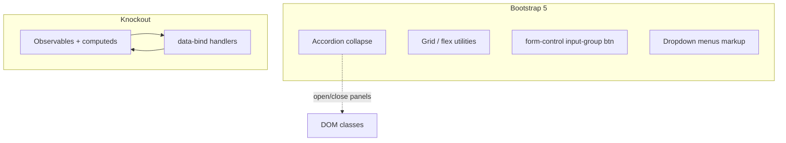

| Bootstrap | Knockout |
|-----------|----------|
| `data-bs-toggle="collapse"` | Which settings values are stored |
| Button/checkbox classes | `playerPlaying`, `isShuffled`, lesson selection |
| Responsive columns | `foreach: words` card grid |
| Dropdown structure | `foreach: lessons.classes` etc. |

Tooltip / Toast / Popover are imported in `index.js` because accordions and some controls rely on Bootstrap’s JS behavior.

**Dark mode:** `darkMode` observable + `theme.ts` + `darkMode` cookie; CSS uses `[data-theme="dark"]` in `src/css/dark-mode.css`. An inline `<head>` script in `template.html` applies theme before paint to reduce flash.

---

## 6. TypeScript module map

```text
src/
├── index.js                    # Webpack entry only
├── template.html               # Main UI (all data-bind)
├── css/
│   ├── style.css
│   └── dark-mode.css
├── configs/
│   └── licwdefaults.json       # Default settings
├── wordfiles/                  # Lesson content JSON (many files)
├── wordfilesconfigs/
│   └── wordlists.json          # Lesson catalog metadata
├── presets/
│   ├── config.json             # Classes → sets → letter groups
│   ├── sets/*.json
│   ├── configs/*.json          # Per-preset settings snapshots
│   ├── overrides/
│   └── legacymixin/
└── morse/
    ├── morse.ts                # MorseViewModel — play/pause/shuffle/cards
    ├── morseLessonFinder.js    # GENERATED — dynamic import map for wordfiles
    ├── morsePresetFinder.js    # GENERATED — preset configs
    ├── morsePresetSetFinder.js # GENERATED — preset sets
    ├── settings/               # MorseSettings, speed, frequency, misc
    ├── lessons/morseLessonPlugin.ts
    ├── player/
    │   ├── morseWordPlayer.ts
    │   ├── wav/morseStringToWavBuffer.ts
    │   └── soundmakers/        # SmoothedSounds vs MorseWavBufferPlayer
    ├── voice/MorseVoice.ts
    ├── utils/                  # morseStringUtils, cardBufferManager, general
    ├── koextenders/morseExtenders.ts
    ├── cookies/morseCookies.ts
    ├── components/             # KO components (html + ts)
    ├── flaggedWords/, rss/, shortcutKeys/, theme/, images/
    └── timing/                 # WPM/FWPM calculators
```

**Legacy / shared:** `src/morse-pro/` — morse-pro-derived timing/decoder pieces.

---

## 7. Lesson and preset data

### 7.1 Data file relationships

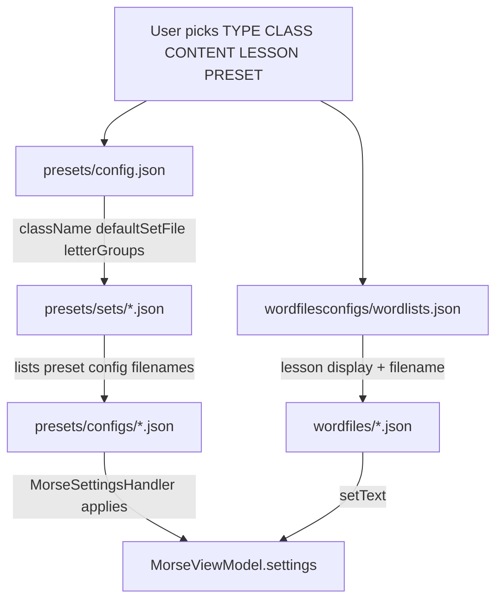

### 7.2 Lesson picker flow

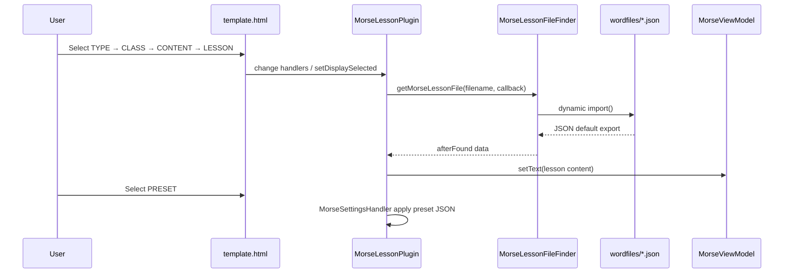

### 7.3 Prebuild and dynamic imports

Webpack must see **static** `import()` paths. Hundreds of lesson/preset files are wired by codegen:

| Script | Scans | Generates |
|--------|-------|-----------|
| `prebuildLessons.js` | `src/wordfiles/` | `src/morse/morseLessonFinder.js` |
| `prebuildPresetSets.js` | preset sets | `morsePresetSetFinder.js` |
| `prebuildPresets.js` | `src/presets/configs/` | `morsePresetFinder.js` |

Each generator copies `*Template.js`, replaces a `// BEGINA` … `// BEGINB` region with one `case 'FILE': import(...)` per disk file.

**Required after adding/removing lesson or preset JSON:**

```bash
npm run prebuild
# or
npm run build   # runs prebuild automatically
```

**Speed Racer** (multiplier ladder, Overlearn presets, deep links): see [SPEED_RACER.md](./SPEED_RACER.md).

Wordfiles are **bundled** via dynamic `import()` (not copied as loose files to `dist/`; see commented `CopyPlugin` in `webpack.config.js`).

---

## 8. Build pipeline

### 8.1 npm scripts

| Script | Action |
|--------|--------|
| `prebuild` | Run all three prebuild generators |
| `build` | `webpack` → `dist/` |
| `postbuild` | `zipdist.js`, `checklessons.js` |
| `dev` | `webpack serve` :3000, watches template + CSS |
| `test` | Vitest |
| `test:e2e` | Playwright (needs `dist/` to be built first) |
| `test:all` | unit + build + e2e |

### 8.2 Webpack flow

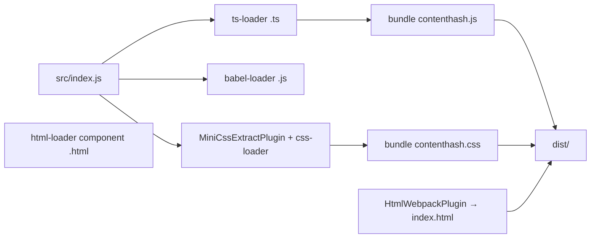

**Notable `webpack.config.js` settings:**

- Entry: `src/index.js` → output `dist/bundle[contenthash].js`
- `devtool: 'inline-source-map'` for debugging
- Node polyfills in `resolve.fallback` (buffer, stream, etc.) for dependencies that expect Node APIs
- `ProvidePlugin` for `process` and `Buffer`
- ESLint during build

### 8.3 Deploy / hosting

Two different targets matter: the **club’s public site** (upstream) and **this fork** (Roger’s dev copy).

#### Club production — GitHub Pages (`LongIslandCW/morsebrowser`)

- **Live app:** https://longislandcw.github.io/morsebrowser/index.html  
- **Zip download:** https://longislandcw.github.io/morsebrowser/download/morse.zip  
- Upstream uses GitHub Actions to publish `dist/` to the **`gh-pages`** branch; Pages serves the site root (and may use a `/dev/` path for beta builds on the club repo).
- When the URL path contains **`/dev/`**, `MorseViewModel.isDev()` is true and the footer shows the **BETA** warning with a link to the stable build (`../`).

#### This fork — Cloudflare Workers (`rdreed21/morsebrowser_dev`)

Roger **does not** use GitHub Pages on the fork. Preview and hosting use **Cloudflare Workers**:

| Piece | Location |
|--------|----------|
| Config | [`wrangler.jsonc`](../wrangler.jsonc) — worker name `morsebrowserdev`, static assets from `dist/` |
| Local preview | `npm run build` → `npm run preview` (`wrangler dev`) or `npm run dev` (webpack dev server, port 3000) |
| Publish | `npm run build` → `npm run deploy` |
| CI on PR/push | Cloudflare **Workers Builds** (links appear in PR checks; e.g. branch preview `develop-morsebrowser.rdreed21.workers.dev`) |

Fork GitHub Actions (`develop2.yml`, `main2.yml`) still run **tests + build** on `develop` / `main`. They also include a **legacy** “Deploy to GitHub Pages” step (`gh-pages` branch, `target-folder: dev` on `develop2.yml`) that is **not** the live fork hosting path today.

#### Git / contributions

See [AGENTS.md](../AGENTS.md): push and PRs on **`origin`** (fork) only; Roger opens upstream PRs to the club repo manually.

---

## 9. Playback pipeline

### 9.1 High-level play loop

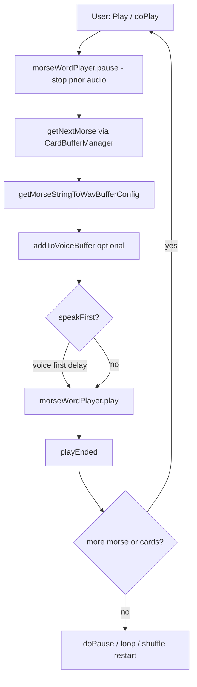

### 9.2 Audio stack

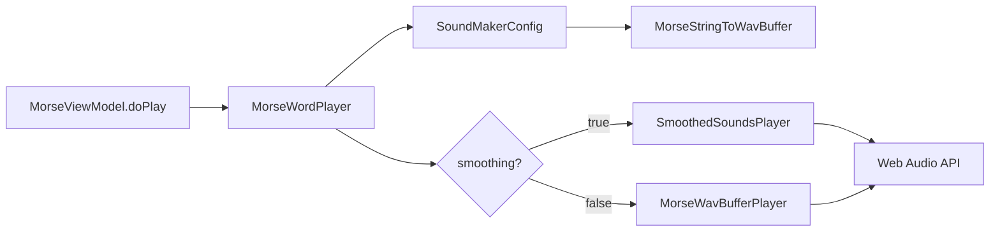

### 9.3 Cards, index, and buffer

| Concept | Implementation |
|---------|----------------|
| **words** | Computed from `rawText`; each `WordInfo` has `displayWord`, grouping |
| **currentIndex** | Highlights active card; advances in `playEnded` |
| **hideList** | Shows `X`.repeat(length) instead of letters |
| **trailReveal** | `maxRevealedTrail` reveals prior cards during play |
| **CardBufferManager** | Splits one card into subparts (repeats, extra word spaces) |
| **Double-click card** | `setWordIndex` — jump playback position |

### 9.4 `doPlay(playJustEnded, fromPlayButton)` (summary)

- Aborts if `rawText` is empty.
- **Fresh start** (`fromPlayButton && !wasPlayerPlaying`): collapse settings accordions, reset timers, clear voice buffer and card buffer, reset char count, prime Safari speech.
- Debounced via `doPlayTimeout` (0 ms or 1000 ms) to avoid overlapping audio.
- Builds config with repeats from `numberOfRepeats`, optional speak-first path through `MorseVoice`.
- On end of each chunk: `playEnded` handles trail delays, voice buffer speak, `cardSpace` delay, then chains `doPlay(true, false)` or stops / loops.

### 9.5 Download

`doDownload` uses the same wav generation path as playback to offer a file download (see Output Options in template).

---

## 10. Settings and persistence

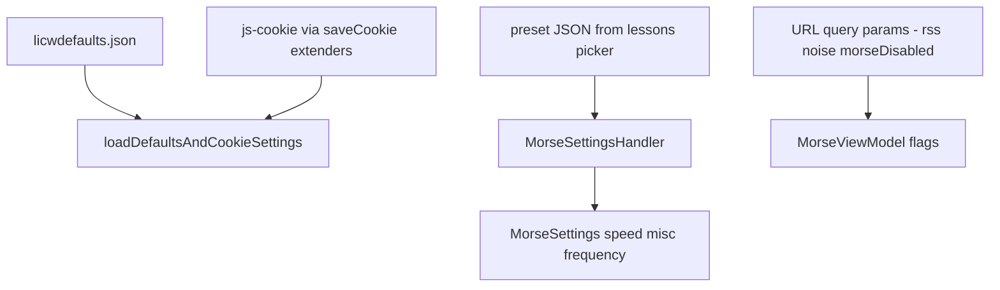

| Source | Examples |
|--------|----------|
| `licwdefaults.json` | Initial WPM, volume, etc. |
| Cookies | `volume`, `darkMode`, `hideList`, lesson accordion prefs, … |
| Preset JSON | Per-lesson timing/speed overrides from `presets/configs/` |
| URL | `?rssEnabled=`, `?noiseEnabled=`, `?morseDisabled=` |

`MorseSettings` groups:

- **speed** — WPM, FWPM (effective), sync lock, variable speed display for intervals
- **frequency** — tone Hz
- **misc** — newline chunking, expert options

---

## 11. Where to change what

| Goal | Start here |
|------|------------|
| Layout, labels, accordion order | `src/template.html` |
| Play / pause / shuffle / cards | `src/morse/morse.ts` |
| Lesson lists, picker logic | `morseLessonPlugin.ts`, `wordlists.json`, `presets/config.json` |
| New lesson file | `src/wordfiles/New.json` + `wordlists.json` + **`npm run prebuild`** |
| New preset | `src/presets/configs/` + set JSON + **`npm run prebuild`** |
| WPM / dit timing math | `src/morse/timing/`, `morseStringToWavBuffer.ts` |
| Tone / smoothing | `src/morse/player/soundmakers/` |
| Voice / speak-first | `src/morse/voice/MorseVoice.ts` |
| Global styles / dark theme | `src/css/style.css`, `dark-mode.css`, `theme.ts` |
| Defaults / cookies | `licwdefaults.json`, `morseCookies.ts`, `morseExtenders.ts` |
| Build / dev server | `webpack.config.js`, `package.json` |

---

## 12. Local development

```bash
npm install
npm run dev          # http://localhost:3000
npm run build        # prebuild + webpack + postbuild zip/check
npm test
npm run build && npm run test:e2e
```

**Debugging tips:**

- Use browser devtools with source maps (inline in dev build).
- Set breakpoints in `morse.ts` `doPlay` / `playEnded` for transport issues.
- After JSON content changes under `wordfiles/` or `presets/configs/`, always run `prebuild`.

**Testing layout (from AGENTS.md):**

- Vitest: utils, timing, lesson plugin, theme
- Playwright: accordions, pickers, Play, dark mode smoke tests

---

## Appendix: Repository map (top level)

```text
morsebrowser_dev/
├── docs/                    ← this guide
├── src/                     ← application source
├── prebuild*.js             ← finder codegen
├── webpack.config.js
├── package.json
├── tests/                   Vitest
├── e2e/                     Playwright
├── .github/workflows/       CI (tests/build); legacy Pages steps — fork uses Workers
└── wrangler.jsonc           Cloudflare Workers (fork deploy)
```

---

*Document version aligns with app footer “Version 2.0”. Update this guide when major UI sections or build steps change.*
