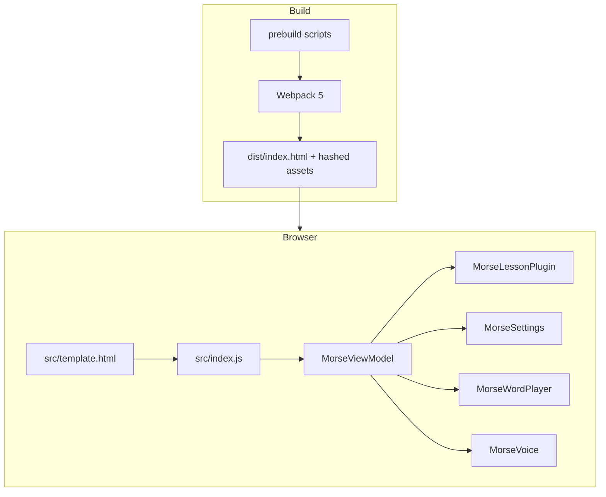
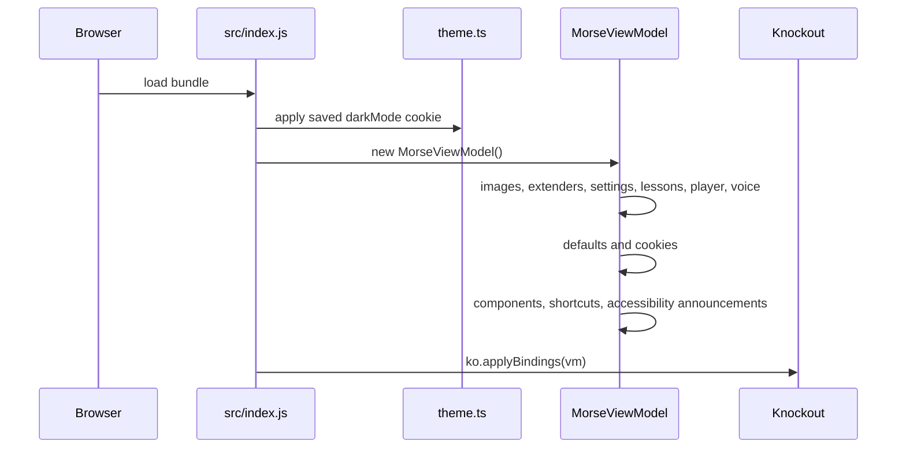
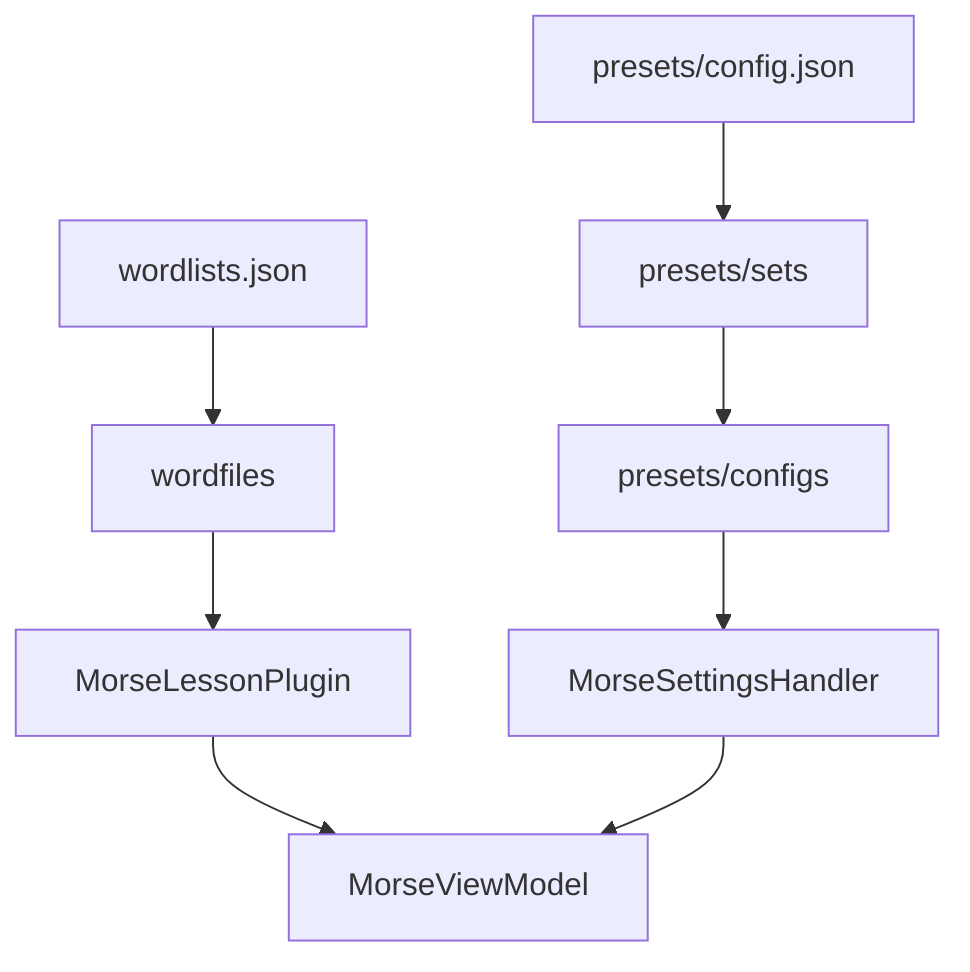
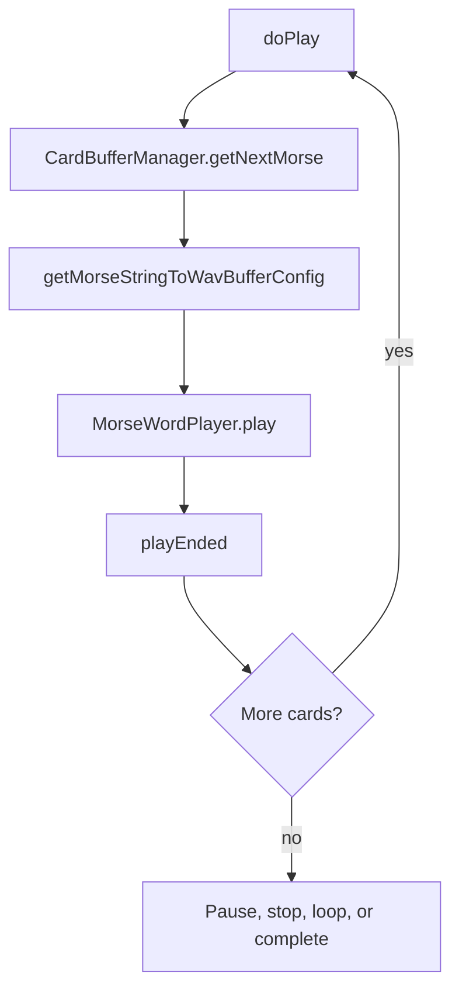

# Morse Practice Page Developer Guide

This guide describes the current structure, build flow, runtime architecture, and maintenance points for the LICW Morse Practice Page.

Related docs:

- [README](../README.md)
- [SPEED_RACER.md](./SPEED_RACER.md)
- [tests/README.md](../tests/README.md)
- [MAINTAINERS.md](../MAINTAINERS.md)
- [AGENTS.md](../AGENTS.md)

## Architecture

The app is a single-page browser app. Webpack builds `src/template.html`, JavaScript, TypeScript, CSS, lesson content, preset content, and image assets into `dist/`.



| Layer | Main files |
|-------|------------|
| Template/UI | `src/template.html`, `src/css/style.css`, `src/css/dark-mode.css` |
| App entry | `src/index.js` |
| Root state | `src/morse/morse.ts` |
| Lessons | `src/morse/lessons/morseLessonPlugin.ts`, `src/wordfilesconfigs/wordlists.json`, `src/wordfiles/` |
| Presets | `src/presets/`, `src/morse/settings/`, `src/morse/settings/morseSettingsHandler.ts` |
| Audio | `src/morse/player/`, `src/morse/timing/`, `src/morse-pro/` |
| Voice | `src/morse/voice/MorseVoice.ts`, `src/easyspeech/easyspeech.js` |
| Persistence | `src/morse/cookies/morseCookies.ts`, `src/configs/licwdefaults.json` |

## Boot Flow



The template also has a small inline `<head>` script that applies `data-theme="dark"` before the bundle loads, reducing light/dark flash.

## UI Layout

`src/template.html` is the source of truth for page structure.

Top-level order:

1. Header: logo, help link, dark mode
2. Basic speed settings: Character Speed, Effective Speed, volume
3. Settings accordions:
   - LICW Lessons, expanded by default
   - Lesson Options
   - Voice Options
   - Tone Options
   - Input Options
   - Output Options
   - Optional RSS
   - Optional Noise
4. Working text stats
5. Playback controls
6. Cards grid
7. Help footer with keyboard shortcuts, credits, version, legal notice
8. One polite screen-reader status live region

Settings accordion details:

| Accordion | Main contents |
|-----------|---------------|
| LICW Lessons | TYPE, CLASS, CONTENT, LESSON, PRESETS dropdowns; Save/Load settings |
| Lesson Options | Overrides, Playback, Timing, Trail |
| Voice Options | Voice, Spell, Arm Recap, Voice First, delays, speaker, volume, Last Only, pitch, rate, Voice After |
| Tone Options | DIT, DAH, sync pitch, Zero Beat |
| Input Options | View/Clear/Insert File, working text textarea, Flagged cards |
| Output Options | PRE, WORD SPACE, CARD WAIT, CARD SIZE, Cards, Audio File |

Fresh Play collapses open settings accordions and scrolls playback controls into view. Resume does not.

## Knockout Patterns

The whole document is bound to one `MorseViewModel`.

Common bindings:

| Binding | Use |
|---------|-----|
| `textInput` | Two-way input values |
| `checked` | Toggle buttons and checkboxes |
| `visible` / `hidden` | Conditional UI |
| `foreach` | Lesson choices, cards, shortcuts |
| `component` | Small Knockout component templates |
| `click` | Buttons and dropdown choices |
| `attr` | Dynamic ARIA, titles, image sources |

Registered components:

| Component | Files |
|-----------|-------|
| `simpleimage` | `src/morse/components/morseImage/` |
| `flaggedwordsaccordion` | `src/morse/components/flaggedWordsAccordion/` |
| `noiseaccordion` | `src/morse/components/noiseAccordion/` |
| `rssaccordion` | `src/morse/components/rssAccordion/` |

## Accessibility

Screen-reader-facing copy is maintained in `src/template.html`, component templates, `MorseViewModel.keyboardShortcutScript`, and live announcements in `registerAccessibilityAnnouncements()`.

Guidelines:

- Keep live announcements short and state-based, such as "Cards are hidden" or "Speed Racer is on".
- Do not put timers or rapidly changing counts in live regions.
- Use `aria-describedby` for helpful hidden context.
- Give component controls meaningful names, especially experimental RSS and Noise controls.
- Custom listbox/dropdown pickers (LICW Lessons TYPE/CLASS/CONTENT/LESSON/PRESETS) must expose **label + current value** on the toggle (`aria-labelledby` spanning both IDs) and **`aria-selected`** on each `role="option"`. Do not name the toggle from the field label alone.
- Update `e2e/accessibility.spec.ts` when changing labels, descriptions, or live-region behavior.

## Lessons And Presets



Prebuild scripts generate static dynamic import maps so Webpack can bundle content:

| Script | Reads | Generates |
|--------|-------|-----------|
| `prebuildLessons.js` | `src/wordfiles/` | `src/morse/morseLessonFinder.js` |
| `prebuildPresetSets.js` | `src/presets/sets/` | `src/morse/morsePresetSetFinder.js` |
| `prebuildPresets.js` | `src/presets/configs/` | `src/morse/morsePresetFinder.js` |

Run `npm run prebuild` after adding or removing content files. `npm run build` does this automatically.

Tom-style deep links use:

```text
?selectedClass=&selectedGroup=&selectedLesson=&selectedPreset=
```

These work on the club Pages site and fork Workers previews.

## Playback



Key playback state:

| State | Role |
|-------|------|
| `rawText` / `showingText` | Practice text and optional textarea view |
| `words` | Computed `WordInfo[]` for cards and playback |
| `currentIndex` | Active card index |
| `hideList` | Whether card text is masked |
| `cardsVisible` | Whether the card section is shown |
| `trailReveal` / `maxRevealedTrail` | Progressive reveal during playback |
| `playerPlaying` / `isPaused` | Transport state |
| `runningPlayMs` / `charsPlayed` | Stats, not live-announced |

Audio is generated through `MorseWordPlayer`, `morseStringToWavBuffer`, and the configured sound maker. Download uses the same generation path to create a WAV file.

## Settings And Persistence

Startup loads defaults from `src/configs/licwdefaults.json`, then user values from browser cookies via `js-cookie`. The class is named `MorseCookies` because the current persistence layer is cookie-based.

Settings can also come from:

- Preset JSON selected in LICW Lessons
- Imported settings JSON
- URL flags such as `rssEnabled`, `noiseEnabled`, and `morseDisabled`

Dark mode is stored as the `darkMode` cookie and applied to `documentElement`.

## Build And Test

| Script | Action |
|--------|--------|
| `npm run prebuild` | Regenerate lesson/preset import maps |
| `npm run build` | Webpack build, then ZIP and lesson consistency check |
| `npm run dev` | Webpack dev server on port 3000 |
| `npm test` | Vitest |
| `npm run test:e2e` | Playwright, serving `dist/` |
| `npm run test:all` | Unit + build + E2E |
| `npm run preview` | `wrangler dev` |
| `npm run deploy` | `wrangler deploy` |

Build output:

- `dist/index.html`
- hashed JS/CSS bundles
- copied assets
- `dist/download/morse.zip`

Known `checklessons.js` warnings may appear during build. Review new warnings when changing lesson data.

## Deployment

Club production:

- Repo: `LongIslandCW/morsebrowser`
- URL: https://longislandcw.github.io/morsebrowser/index.html
- Hosting: GitHub Pages

This fork:

- Repo: `rdreed21/morsebrowser_dev`
- Worker: `morsebrowserdev`
- Config: `wrangler.jsonc`
- Deploy: `npm run build` then `npm run deploy`

The fork workflows still contain legacy GitHub Pages deploy steps. Current fork hosting is Cloudflare Workers.

The BETA footer appears when `window.location.href` contains `/dev/`.

## Where To Change What

| Goal | Start here |
|------|------------|
| UI text, labels, accordion order | `src/template.html` |
| Screen-reader labels in component panels | `src/morse/components/*/*.html` |
| Live announcements and shortcuts script | `src/morse/morse.ts` |
| Keyboard shortcut handlers | `src/morse/shortcutKeys/morseShortcutKeys.ts` |
| Lesson picker and deep links | `src/morse/lessons/morseLessonPlugin.ts` |
| New lesson | `src/wordfiles/` + `wordlists.json` + `npm run prebuild` |
| New preset | `src/presets/configs/` + preset set JSON + `npm run prebuild` |
| Speed Racer | `src/morse/settings/speedSettings.ts`, `src/morse/morse.ts`, `docs/SPEED_RACER.md` |
| Mobile settings sizing | `src/css/style.css`, `e2e/settings-layout-mobile.spec.ts` |
| Accessibility assertions | `e2e/accessibility.spec.ts` |

## Repository Map

```text
morsebrowser_dev/
├── docs/
├── e2e/
├── src/
├── tests/
├── prebuildLessons.js
├── prebuildPresets.js
├── prebuildPresetSets.js
├── webpack.config.js
├── wrangler.jsonc
└── zipdist.js
```
